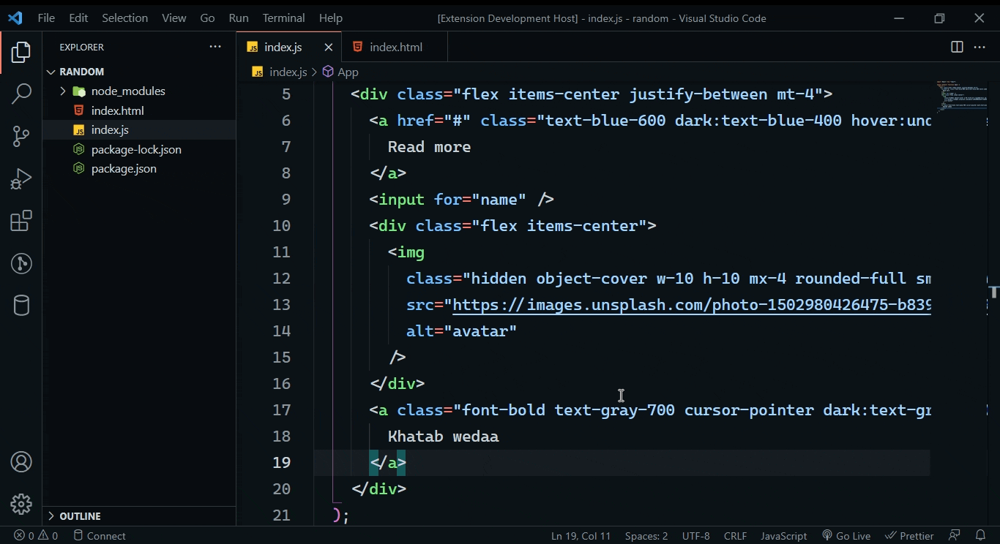
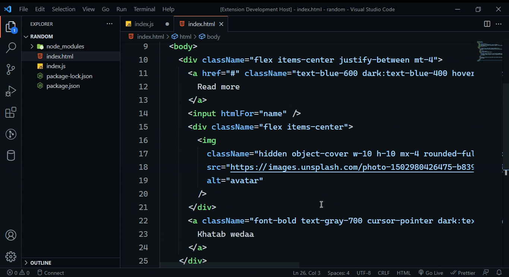
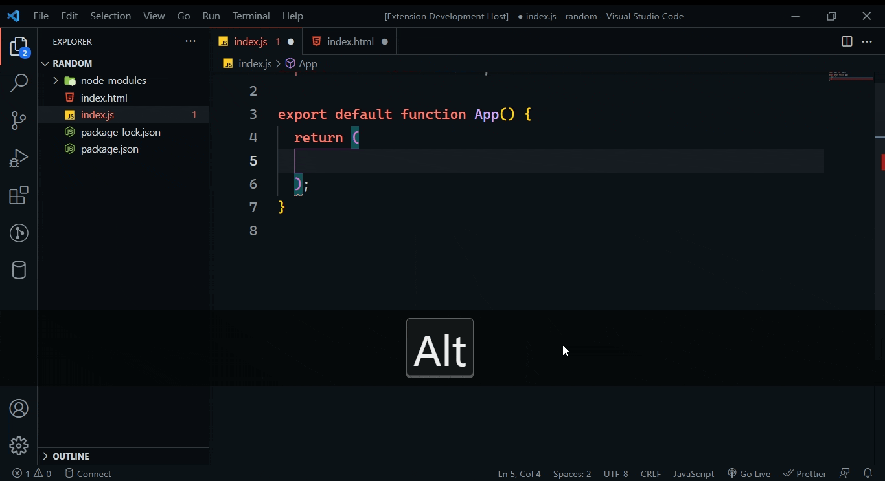

# html-to-jsx

A vs code extension that converts html to jsx and jsx to html. You
can also paste html as jsx using the
shortcut <kbd>ctrl</kbd>+<kbd>alt</kbd>+<kbd>v</kbd>

1. Convert `HTML` to `JSX`
   

1. Convert `JSX` to `HTML`
   

1. Paste as JSX
   
